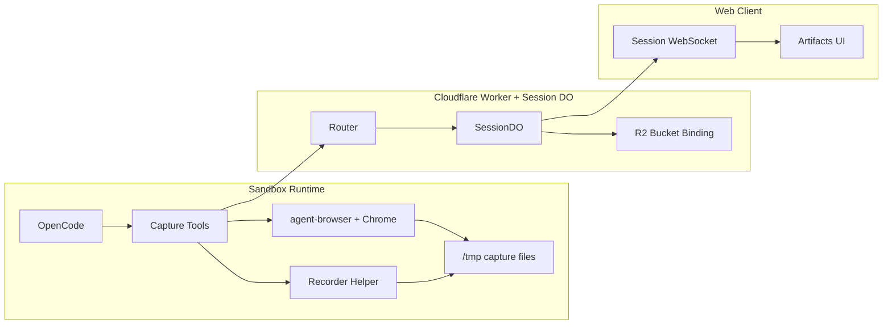
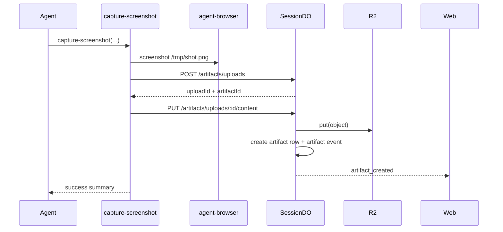
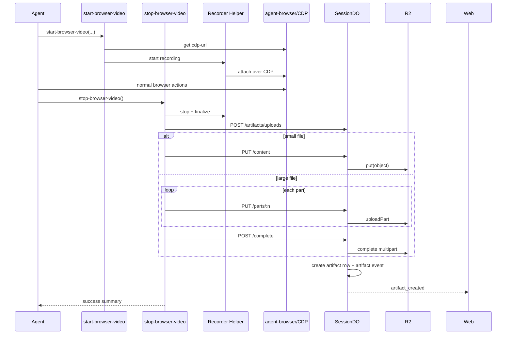

# Agent-Browser Media Capture Design

Status: Draft Date: 2026-04-10 Primary audience: control-plane, sandbox-runtime, web, infra

## Summary

Open-Inspect should support first-class screenshot capture and short video recordings from agent
sessions, with a strong bias toward frontend verification workflows.

The design centers on four decisions:

1. Keep capture session-scoped and artifact-scoped inside the existing Session Durable Object model.
2. Store binary media in a private Cloudflare R2 bucket bound to the control-plane Worker.
3. Use `agent-browser` for screenshot capture and browser session ownership, while implementing
   video recording as a thin recorder helper that attaches to the same `agent-browser` browser
   session via CDP.
4. Reuse the existing artifact list, `artifact_created` websocket fanout, and session UI patterns
   instead of introducing a parallel media system.

This gives the agent a reliable way to prove frontend changes, preserves multiplayer/session
semantics, and keeps storage and access control in the control plane rather than the sandbox.

## Why This Exists

The current repository already contains most of the right primitives, but not the end-to-end media
pipeline:

- `packages/modal-infra/src/images/base.py` installs `agent-browser` and Chromium in every Modal
  sandbox image.
- `packages/sandbox-runtime/src/sandbox_runtime/entrypoint.py` copies custom JS tools into
  `.opencode/tool`, which is the right insertion point for capture tools.
- `packages/control-plane/src/session/schema.ts` already has a session-local `artifacts` table.
- `packages/control-plane/src/session/sandbox-events.ts` already supports websocket fanout and event
  persistence, but it does not currently turn sandbox-created media into artifact rows.
- `packages/shared/src/types/index.ts` and `packages/web/src/types/session.ts` already model
  `screenshot` artifacts, but not `video`.
- `packages/web/src/hooks/use-session-socket.ts` already hydrates artifacts from the socket, but the
  current web UI only surfaces PR and preview artifacts.
- `terraform/modules/cloudflare-worker` currently supports KV, D1, service bindings, and Durable
  Objects, but not R2 bindings.

The result is that the agent has browser automation installed, but no durable, authenticated,
user-facing path for captured media.

## Goals

- Let the agent capture screenshots from the active browser session.
- Let the agent record short browser videos from the active browser session.
- Persist captures across reconnects, session restores, and sandbox shutdowns.
- Surface captures as first-class session artifacts in web.
- Keep media private by default.
- Reuse existing session auth, artifact, and websocket patterns where possible.
- Work with the current control-plane and sandbox boundaries instead of introducing a separate media
  service.

## Non-Goals

- Live desktop streaming or VNC.
- Full browser session replay.
- Public, unauthenticated artifact URLs.
- Chrome extension upload flows.
- Automatic PR-body enrichment in v1.
- General-purpose large file storage outside session artifacts.

## Current Constraints

### Codebase constraints

- Session state is isolated per Durable Object. This is a good fit for artifact metadata and upload
  lifecycle state.
- The web app already fetches a participant-scoped websocket token from
  `/api/sessions/[id]/ws-token`.
- The control plane already validates sandbox tokens for sandbox-authenticated routes.
- The current worker infra does not bind an R2 bucket yet.
- The current web UI has no artifact gallery or media player surface.

### Product constraints

- We want screenshots and videos to feel like proof artifacts, not debug dumps.
- We want to stay primarily on `agent-browser`, not build a parallel browser stack for normal
  interaction.
- We need to handle multiplayer sessions cleanly.

### Upstream tool constraints

- `agent-browser` already supports screenshot capture, stateful browser sessions, and retrieving the
  current CDP URL.
- The current upstream CLI documents screenshots and traces, but not a first-class video recording
  command.

That means screenshots can use the native CLI directly, while video needs a small local recorder
implementation that piggybacks on the existing `agent-browser` browser session.

## Proposed Architecture



### Core shape

- Capture happens inside the sandbox.
- Metadata and upload lifecycle are managed by the Session Durable Object.
- Binary objects live in R2.
- Web consumes session artifacts over the existing websocket and renders media using authenticated
  artifact URLs.

### Why this shape

- It keeps the current session boundary authoritative.
- It avoids a new global media service.
- It keeps artifact writes, websocket broadcasts, and storage metadata in one place.
- It works for both fresh sessions and restored sessions.
- It remains provider-agnostic above the sandbox-runtime layer.

## Design Details

## 1. Artifact Model

### Shared types

Extend `ArtifactType` to:

```ts
export type ArtifactType = "pr" | "screenshot" | "preview" | "branch" | "video";
```

Add explicit media metadata types in `@open-inspect/shared`:

```ts
interface MediaArtifactMetadataBase {
  filename: string;
  mimeType: string;
  byteSize: number;
  sha256: string;
  storageKey: string;
  sourceUrl?: string;
  pageTitle?: string;
  messageId?: string;
  authorId?: string;
  captureMode: "agent";
  label?: string;
  captureGroupId?: string;
  viewport?: { width: number; height: number; deviceScaleFactor?: number };
}

interface ScreenshotArtifactMetadata extends MediaArtifactMetadataBase {
  kind: "screenshot";
  fullPage: boolean;
  annotated: boolean;
  format: "png" | "jpeg";
}

interface VideoArtifactMetadata extends MediaArtifactMetadataBase {
  kind: "video";
  durationMs: number;
  format: "mp4";
  fps: number;
  posterStorageKey?: string;
}
```

Notes:

- `storageKey` points to the original object in R2.
- `url` on the artifact remains the canonical unsigned content route:
  `https://<control-plane>/sessions/:id/artifacts/:artifactId/content`
- The web client appends a token query parameter when rendering or downloading media.

### Session DO schema

Keep the existing `artifacts` table.

Add a new `artifact_uploads` table to the Session DO SQLite schema:

```sql
CREATE TABLE IF NOT EXISTS artifact_uploads (
  id TEXT PRIMARY KEY,
  artifact_id TEXT NOT NULL,
  artifact_type TEXT NOT NULL,
  upload_mode TEXT NOT NULL,               -- 'single' | 'multipart'
  status TEXT NOT NULL,                    -- 'pending' | 'completed' | 'aborted'
  r2_key TEXT NOT NULL,
  content_type TEXT NOT NULL,
  filename TEXT NOT NULL,
  multipart_upload_id TEXT,
  metadata TEXT,                           -- JSON metadata supplied at initiation
  created_at INTEGER NOT NULL,
  expires_at INTEGER NOT NULL
);

CREATE INDEX IF NOT EXISTS idx_artifact_uploads_status_expires
  ON artifact_uploads(status, expires_at);
```

Why a separate table:

- Multipart uploads span multiple HTTP requests.
- Upload state must survive DO hibernation and request retries.
- R2 auto-aborts incomplete multipart uploads after 7 days, but we still need local state to
  validate and finalize uploads.

## 2. Storage Model

### Bucket

Create one private R2 bucket for session media artifacts, for example:

`open-inspect-session-artifacts-<deployment>`

The bucket is private. No public bucket mode is used in v1.

### Object keys

Use deterministic keys:

`sessions/<sessionId>/artifacts/<artifactId>/original.<ext>`

Optional poster:

`sessions/<sessionId>/artifacts/<artifactId>/poster.jpg`

This keeps cleanup and debugging simple and makes it easy to inspect all artifacts for a session.

### Object metadata

Set R2 HTTP metadata on write:

- `contentType`
- `cacheControl: private, max-age=31536000, immutable`
- `contentDisposition: inline; filename="<filename>"`

Set custom metadata:

- `sessionId`
- `artifactId`
- `artifactType`
- `repoOwner`
- `repoName`

### Retention

v1 recommendation:

- Keep objects indefinitely.
- Keep the bucket private.
- Revisit lifecycle rules after measuring real artifact volume.

Rationale:

- Session artifacts are part of the session record.
- Premature expiry creates broken session history.
- R2 cost is low enough that correctness is the better default for the initial rollout.

## 3. Upload and Download APIs

## Public routes

Add the following control-plane routes:

- `POST /sessions/:id/artifacts/uploads`
- `PUT /sessions/:id/artifacts/uploads/:uploadId/content`
- `PUT /sessions/:id/artifacts/uploads/:uploadId/parts/:partNumber`
- `POST /sessions/:id/artifacts/uploads/:uploadId/complete`
- `POST /sessions/:id/artifacts/uploads/:uploadId/abort`
- `GET /sessions/:id/artifacts/:artifactId/content`

### Auth

Upload routes:

- Use existing sandbox-auth validation.
- Add these paths to `SANDBOX_AUTH_ROUTES`.

Download route:

- Accept either:
  - `Authorization: Bearer <token>`, or
  - `?token=<token>`
- Reuse the existing participant websocket token for v1.

Why reuse the websocket token:

- The web app already fetches it.
- It is already session-scoped and participant-scoped.
- It avoids inventing a second token class for the same session page.

The semantics become: the websocket token is the session media read token as well.

## Internal DO routes

Add matching internal Session DO routes:

- `POST /internal/artifact-uploads/init`
- `PUT /internal/artifact-uploads/:id/content`
- `PUT /internal/artifact-uploads/:id/parts/:partNumber`
- `POST /internal/artifact-uploads/:id/complete`
- `POST /internal/artifact-uploads/:id/abort`
- `GET /internal/artifacts/:artifactId/content`

### Upload initiation request

```json
{
  "artifactType": "screenshot",
  "filename": "home-after.png",
  "mimeType": "image/png",
  "byteSize": 482193,
  "metadata": {
    "label": "after",
    "fullPage": true,
    "annotated": false,
    "sourceUrl": "http://localhost:3000/"
  }
}
```

### Upload initiation response

Small object:

```json
{
  "uploadId": "upl_123",
  "artifactId": "art_123",
  "mode": "single",
  "contentPath": "/sessions/<id>/artifacts/uploads/upl_123/content"
}
```

Large object:

```json
{
  "uploadId": "upl_456",
  "artifactId": "art_456",
  "mode": "multipart",
  "partSizeBytes": 8388608,
  "partPathTemplate": "/sessions/<id>/artifacts/uploads/upl_456/parts/{partNumber}",
  "completePath": "/sessions/<id>/artifacts/uploads/upl_456/complete"
}
```

### Upload strategy

Recommended defaults:

- `SINGLE_UPLOAD_MAX_BYTES = 32 MiB`
- `MULTIPART_PART_SIZE_BYTES = 8 MiB`
- `MAX_VIDEO_BYTES = 250 MiB`
- `MAX_VIDEO_DURATION_SECONDS = 90`

Why:

- 8 MiB parts stay well below Cloudflare request body limits on all plans.
- 32 MiB keeps screenshot uploads simple.
- 90 seconds is enough for frontend flows without encouraging massive recordings.

### Completion behavior

When an upload completes successfully, the DO must:

1. Create the artifact row.
2. Create a synthetic `artifact` event in the event log.
3. Broadcast `artifact_created`.
4. Optionally broadcast a `sandbox_event` with type `artifact`.
5. Mark the upload row completed.

This is important because:

- The artifact list remains the authoritative source of truth.
- Existing consumers already understand `artifact_created`.
- The shared completion extractor already knows how to summarize `artifact` events.

## 4. Screenshot Capture Tool

Add a new OpenCode tool in `packages/sandbox-runtime/src/sandbox_runtime/tools/`:

`capture-screenshot.js`

### Tool contract

```ts
{
  label?: string;
  url?: string;
  waitFor?: "load" | "domcontentloaded" | "networkidle";
  fullPage?: boolean;
  annotated?: boolean;
  format?: "png" | "jpeg";
  quality?: number; // only for jpeg
  captureGroupId?: string;
}
```

### Behavior

1. If `url` is provided, call `agent-browser open <url>`.
2. If `waitFor` is provided, call `agent-browser wait --load <state>`.
3. Capture to a temp file via `agent-browser screenshot`.
4. Resolve page URL and title.
5. Compute file size and sha256.
6. Initiate upload with the control plane.
7. Upload content.
8. Return a concise summary including artifact ID, label, and canonical URL.

### Notes

- v1 captures the current page or full page.
- Element-scoped screenshots are deferred.
- Annotated screenshots are supported because `agent-browser` already exposes them.

## 5. Video Capture Tooling

Add two new OpenCode tools:

- `start-browser-video.js`
- `stop-browser-video.js`

### Why separate start and stop

The agent often needs to:

- start recording
- drive the page through several steps
- stop recording

A one-shot `record-video` tool would force the tool itself to own navigation and interaction, which
duplicates `agent-browser` and makes the recorder less composable.

### Recorder implementation

Add a local recorder helper in sandbox-runtime that:

1. Uses `agent-browser get cdp-url` to discover the active browser session.
2. Attaches to the same Chrome instance over CDP.
3. Starts a screen-frame stream from the active page.
4. Pipes frames into `ffmpeg`.
5. Writes an `mp4` file in `/tmp`.

Recommended implementation details:

- Add `ffmpeg` to the base image.
- Encode to `video/mp4`.
- Default to `fps = 8`.
- Record only the active page for the current `agent-browser` session.
- Persist recorder state in `/tmp/openinspect-browser-video.json`.

### Why this approach

- The browser state stays owned by `agent-browser`.
- The agent does not need to replay the flow in a second browser.
- We avoid building a general browser recorder service in the control plane.

### Tool contracts

`start-browser-video`:

```ts
{
  label?: string;
  fps?: number;
  maxDurationSeconds?: number;
  captureGroupId?: string;
}
```

`stop-browser-video`:

```ts
{
  label?: string;
}
```

### Behavior

Start:

1. Validate there is no active recording.
2. Resolve the active `agent-browser` CDP URL.
3. Start the recorder helper in the background.
4. Persist recorder state.

Stop:

1. Stop the recorder helper.
2. Finalize the `mp4`.
3. Resolve current page URL and title.
4. Compute duration, size, and sha256.
5. Upload using single or multipart mode.
6. Register the artifact.

### Hard limits

- Default `maxDurationSeconds = 30`
- Hard max `90`
- Stop automatically if the limit is reached

If auto-stop happens, the helper still uploads the partial recording and marks metadata accordingly.

## 6. Browser Session Hygiene

To make media capture reliable, the sandbox runtime should set stable browser session environment
variables before starting OpenCode:

- `AGENT_BROWSER_SESSION=<sessionId>`
- `AGENT_BROWSER_PROFILE=/workspace/.openinspect/agent-browser-profile`

Why:

- Every shell command and every capture tool must target the same browser session.
- The browser profile should survive prompt boundaries and snapshot restore.
- Frontend flows often require login state, cookies, and cached app state.

This is a small but important part of the design.

## 7. Web Experience

## Artifact hydration

Keep using the existing websocket artifact snapshot and `artifact_created` flow.

Extend web artifact types to include `video` and richer metadata.

## Authenticated media URLs

The web client already fetches the websocket token in `useSessionSocket`.

Build artifact URLs client-side:

```ts
buildAuthenticatedUrl(artifact.url, wsToken);
```

This mirrors the existing ttyd terminal pattern.

### UI changes

Add an `ArtifactsSection` to the right sidebar with:

- screenshot thumbnail cards
- inline video cards
- label, source URL, timestamp
- open/download actions

Recommended v1 ordering:

- newest first
- videos mixed with screenshots

Recommended v1 empty state:

- "Screenshots and videos captured by the agent will appear here."

### Optional event-stream rendering

The design creates synthetic `artifact` events so the event stream can render inline artifact cards
later, but inline rendering is not required for the first rollout.

## 8. Control-Plane and Infra Changes

## Worker environment

Add an R2 binding to `Env`:

```ts
SESSION_ARTIFACTS_BUCKET: R2Bucket;
```

Optional plain-text env vars:

- `ARTIFACT_SINGLE_UPLOAD_MAX_BYTES`
- `ARTIFACT_MULTIPART_PART_SIZE_BYTES`
- `ARTIFACT_MAX_VIDEO_BYTES`
- `ARTIFACT_MAX_VIDEO_DURATION_SECONDS`

## Terraform

### Cloudflare worker module

Extend `terraform/modules/cloudflare-worker` to accept:

```hcl
variable "r2_buckets" {
  type = list(object({
    binding_name = string
    bucket_name  = string
  }))
  default = []
}
```

Emit `type = "r2_bucket"` bindings in `local.bindings`.

### Production env

Create a private R2 bucket and bind it to the control-plane Worker:

- bucket name: `open-inspect-session-artifacts-${local.name_suffix}`
- binding name: `SESSION_ARTIFACTS_BUCKET`

No public bucket configuration is required.

## 9. End-to-End Flows

### Screenshot flow



### Video flow



## 10. Security

### Upload security

- Only sandboxes can hit upload endpoints.
- The existing sandbox token remains the write authority.
- Upload rows are session-local and cannot be replayed across sessions.

### Download security

- Artifacts remain private by default.
- Downloads require the participant token.
- Token TTL remains bounded by the existing websocket token TTL.

### Storage security

- The R2 bucket is private.
- No public bucket URLs are exposed.
- No R2 access keys are injected into sandboxes.

### MIME/type restrictions

Only allow expected types in v1:

- `image/png`
- `image/jpeg`
- `video/mp4`

Reject everything else.

## 11. Observability

Add structured logs for:

- `artifact.upload_init`
- `artifact.upload_part`
- `artifact.upload_complete`
- `artifact.upload_abort`
- `artifact.download`
- `artifact.capture_screenshot`
- `artifact.capture_video_start`
- `artifact.capture_video_stop`

Recommended metrics:

- screenshot count
- video count
- upload failure count
- average upload latency
- average artifact size
- average video duration
- multipart completion rate

## 12. Testing

## Control plane

- unit tests for upload initiation validation
- unit tests for single upload completion
- unit tests for multipart completion and abort
- unit tests for media download auth
- SessionDO tests for artifact event + `artifact_created` fanout

## Web

- artifact hydration tests for `video`
- sidebar rendering tests for screenshot and video cards
- authenticated media URL helper tests

## Sandbox runtime

- tool tests for screenshot capture command assembly
- tool tests for recorder lifecycle
- retry tests for failed upload

## Integration

- end-to-end screenshot capture from a session page
- end-to-end video capture for a short browser flow
- restore session after snapshot and verify old artifacts still load

## 13. Rollout Plan

### Phase 1

- R2 bucket binding
- artifact upload/download routes
- `video` artifact type
- screenshot tool
- sidebar artifact gallery

### Phase 2

- video start/stop tools
- recorder helper + `ffmpeg`
- multipart uploads
- synthetic `artifact` event rendering in the event stream

### Phase 3

- optional poster generation
- optional PR description enrichment
- optional screenshot diff workflows using `agent-browser diff screenshot`

## 14. Alternatives Considered

### A. Public bucket or public URLs

Rejected.

Reason:

- Session captures may contain internal code, URLs, credentials-on-screen, or user data.
- Private-by-default is the correct baseline.

### B. Presigned S3 URLs directly from the sandbox

Deferred.

Reason:

- It would require provisioning R2 S3 signing credentials in the control plane.
- The current architecture already has a clean session-auth path through the Worker and DO.
- Chunked uploads through the Worker are sufficient for the initial product scope.

This can be revisited later for browser or extension-origin direct uploads.

### C. A second browser controlled by Playwright for video

Rejected for v1.

Reason:

- It diverges from the `agent-browser` session the agent is actually using.
- It risks recording the wrong auth state or the wrong page state.

### D. Traces instead of videos

Insufficient.

Reason:

- They are valuable for debugging, but they are not the proof artifact users expect when reviewing
  frontend behavior.

## 15. Open Questions

These do not block the core architecture:

1. Should we generate a poster image for every video in v1 or defer until phase 3?
2. Should we expose a repo-level sandbox setting for enabling or disabling media capture, or keep it
   globally enabled initially?
3. Should we render artifact cards inline in the event stream immediately, or keep the first rollout
   in the sidebar only?

## Recommendation

Proceed with the design above.

The key implementation bet is:

- screenshots use native `agent-browser`
- videos attach to the same `agent-browser` browser session via CDP
- all media registration and storage flow through the Session Durable Object and private R2 bucket

That is the best fit for the current codebase because it extends existing session/artifact
boundaries instead of fighting them.
